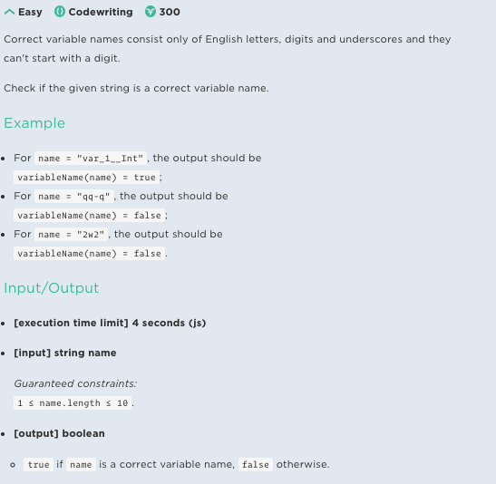

## Problem



## My solution

```javascript
const isDigit = char => /\d/.test(char);
const isValidChar = char => /[\da-zA-Z_]/.test(char);
const variableName = name => {
  const firstChar = name.split('')[0];
  const charArr = name.split('');
  if (isDigit(firstChar)) return false;
  return charArr.every(char => isValidChar(char));
};
```

## Solution

```javascript
function variableName(name) {
  return /^[a-z_]\w*$/i.test(name)
}

```

## Python Solution

```python
def variableName(name):
    if re.match('^[a-z_][0-9_a-z]*$', name, re.IGNORECASE):
        return True
    return False
```

## What I learned 

- `[ ]`  를 통한 range 
- `^` 시작 
- `$`  끝

- [파이썬의 정규식](https://wikidocs.net/4308) 