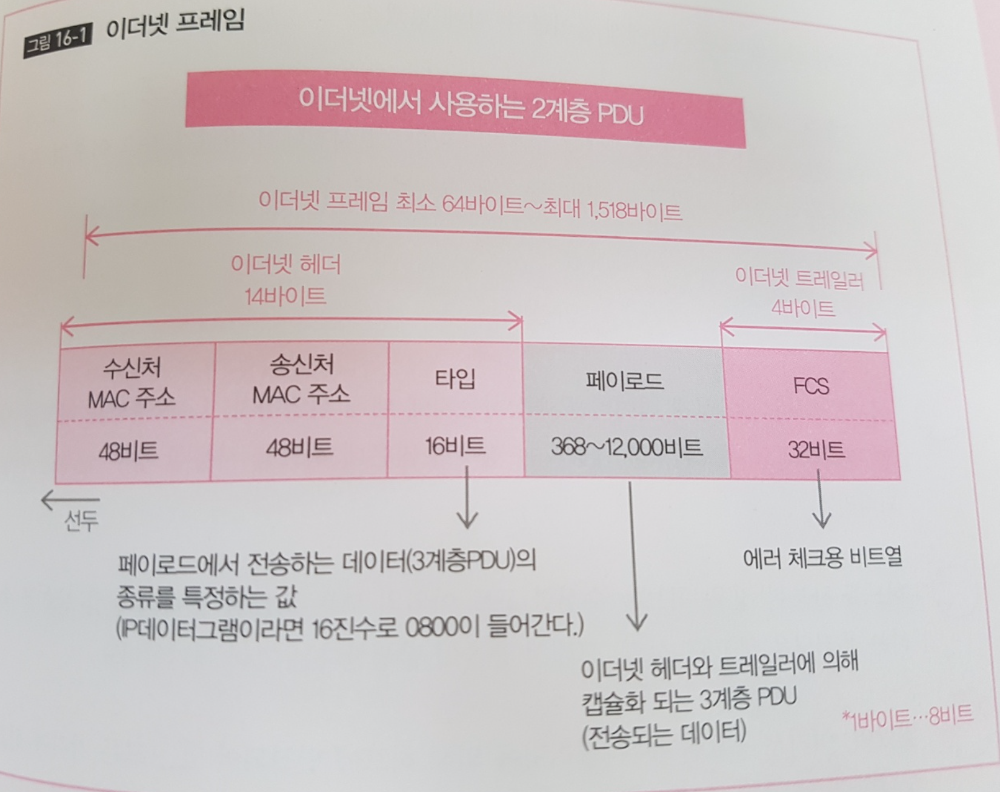
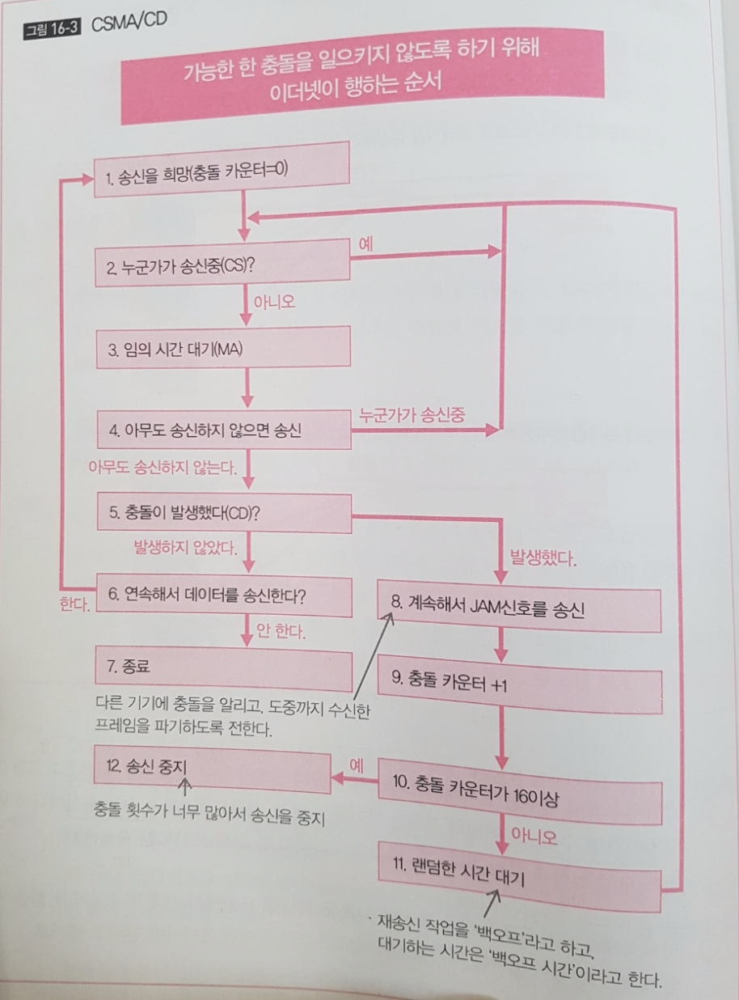

## 2계층의 역할과 개요 
- 2계층은 신호가 도달하는 범위에서의 데이터의 송수신을 생각한다
- 2계층에서는 WAN과 LAN의 규칙이 다르다
- LAN에서는 '이더넷' 이 사실표준이다. 

### 여러개의 컴퓨터가 허브에 연결되어 있을때
- 컴퓨터에서 송신된 신호가 허브에 도달하면 허브는 신호를 수신한 포트 이외의 모든 포트에 신호를 송신 &rarr; 허브에 연결되어있는 다른 컴퓨터에 도달 
- `1대에만 도달하도록 하는 방법`을 생각해야할 필요 있음 
- 또 여러 대의 컴퓨터가 허브에 연결되어 있으면 우연히 동시에 송신한 경우에 신호 충돌이 일어남
- 신호의 송신 전이나 수신 후에 바르게 데이터를 송수신하는 순서가 필요함(충돌을 막기 위함)

### 세그먼트 범위
- 신호가 닿는 범위 
- 멀티 엑세스 네트워크라면 허브로 연결되어 있는 기기 전체
- 포인트 투 포인트 네트워크 라면 서로 연결되어 있는 두대
### 프레이밍과 신호의 동기
- 1계층에서 주고받는 신호를 비트화해 거기에 의미를 갖게 하는 것이 프레이밍
- 2계층의 PDU(Protocol Data Unit:PDU, 데이터와 데이터를 보내기 위해 필요한 것들이 통합된 상태)
- 프레이밍을 시행함으로써 송수신되는 신호를 '데이터' 로 인식할 수 있게됨

- 프리엠블(데이터의 시작) 신호로 시작하고
- 이어서 데이터 비트를 신호화해서 붙여 송신
- 비트를 신화할 때 1비트분의 신호의 폭을 정했다.
- 신호를 제대로 다루기 위해서는 비트를 읽는 타이밍이 송신측과 수신측 양쪽이 일치해야 한다. 이게 어긋나면 비트 중간부터 읽기 시작하게 된다.
- 이 타이밍을 맞추는 방법으로 데이터를 송수신하지 않는 상태에서도 `Clock 신호`라고 부르는 `타이밍을 맞추는 신호`를 보내는 방법이 있음 &rarr; 동기 통신
- 동기 통신의 경우 `프리엠블`을 사용하지 않지만 지속적으로 신호를 보내야 하는 비용이 들기 때문에 프리엠블을 사용
- `프리엠블`을 보냄으로써 이제부터 데이터가시작된다는 것을 알게 되기 때문에 비트를 읽을 타이밍을 이 `프리엠블` 에서 맞춤
- 이너넷의 경우 `1` 과 `0`을 교대로 프리엠블로 보내는데 이것을 읽고 수신측에서 비트를 읽는 타이밍을 맞춤 

- 패킷을 사용한 패킷 교환 방식에서 프리엠블 방식이 일반적 
## 2계층의 주소와 이더넷 
- 1대 1인 유니케스트, 1대 전체인 브로드캐스트, 1대 다수인 멀티캐스트가 있다
- 기기는 한 개 이상의 유니캐스트 주소를 가진다.
- 이너넷에는 MAC 주소가 사용된다. 
### 주소와 캐스트
- 주소: 데이터를 보내는 상대와 자신을 특정하는 데이터
- 어드레싱(addressing): 주소를 어떻게 사용하지 어떻게 배정할지 결정하는 것
- 유니케스트: 1 대 1 데이터 통신
- 브로드캐스트: 전원, 즉 모두에게 메시지를 보내는 데이터 통신 
- 멀티캐스트: 1대 다수, 지정된 복수의 기기로 메시지를 보내는 데이터 통신 
### MAC 주소 
- 각각의 기기는 유니캐스트 주소를 적어도 한개 이상 가진다.
- `라우터처럼 복수의 인터페이스를 가진 기기는 인터페이스마다 유니캐스트 주소를 갖는다`
- 유니캐스트 주소는 유일하다. 
- 이더넷에서 사용되는 주소는 MAC 주소(Media Access Control Address)이며, 이 주소는 인터페이스에 지정된 고정 주소다.
- 인터페이스가 고장나서 다른 인터페이스로 교환하거나 하면 MAC 주소도 변경된다. MAC 주소는 48비트 값으로 4비트마다 16진수로 고쳐서 쓴다. 
- MAC 주소의 선두 24비트는 `벤더코드` 라 불리며 인터페이스를 제조한 메이커 번호다.
- MAC 주소 후반의 24비트는 `벤더 할당 코드`이다

## 이더넷 
- 이더넷에서는 수신처와 송신처의 MAC 주소, 에러 체크 등을 헤더, 트레일러로 붙인다.
- 수신한 프레임의 수신처가 자기가 아닌 경우는 파기한다. 
- 되도록 충돌을 막기 위해 CSMA/CD를 사용한다 
### 이더넷 프레임
- 2계층의 프로토콜은 LAN, WAN 에 따라 달라지는데, LAN 에서는 이더넷 이라는 규칙이 사용됨 
  
- 이너넷이 사용되는 주소가 바로 MAC 이며, 이 주소를 써서 수신처와 송신처를 특정함
- 그 주소를 사용해 누구로 부터, 어디로를 결정하고 헤더에 기술(표기) 해서 송신함
- 이더넷에서는 이더넷 헤더와 이더넷 트레일러 를 데이터그램에 붙여서 이더넷 프레임으로 캡슐화 하고, 이 이더넷 프레임이 신호가 돼서 케이블로 전달됨  (데이터 그램? 메시지에 4계층 제어정보를 덧붙인 상태를 세그먼트, 또는 데이터 그램이라 부름, 3계층의 제어정보를 덧붙인 상태를 데이터 그램이라 부름, 실제로는 그 앞에 프로토콜명을 붙어서  "TCP 세그먼트라던가, IP 데이터그램이라고 부름
- 헤더에는 수신처의 주소, 송신처의 주소, 페이로드의 내용을 식별하는 타입이 붙고, 트레일러에는 에러를 체크하는 FCS(Frame Check Sequence?)가 붙는다 
- 신호가 전송되는 동안에 문제가 생겨서 정확하게 읽을 수 없게 되거나 '0'  과 '1' 로 또는 그 반대로 읽어버리는 경우가 있다. 그런 에러를 처리하기 위해 FCS 를 붙여둔다.
- 기본적으로 통신중에는 에러를 고칠 수 없다. '바른 데이터' 인지 아닌지는 에러가 발생하지 않는 데이터를 수신하지 않는 한 알 수 없기 때문이다.
- FCS는 에러가 발생했는지 아닌지는 알지만 어느 상태가 올바른 상태인지는 모른다. 
- 결과적으로 통신 도중에 에러를 고칠 수 없고, 에러가 있었던 프레임은 파기한다. 그 시점에서 버려지고 이후의 처리는 하지 않고, 파기사실은 송신측에 알리지 않는다. 
### 이더넷 동작 
- LAN 에서 허브를 사용한 멀티엑세스 네트워크를 채용하는 경우가 많다. 
- 허브를 사용한 경우 '허브는 수신한 포트 이외의 모든 포트를 통해 수신한 신호를 송신하는 플러딩' 을 하고 그래서 출동이 발생한다.
- 허브를 사용한 멀티엑세스 네트워크의 경우 신호, 즉 데이터는 모든 기기에 도달하게 되기 때문에, 이더넷에서는 `수신한 프레임의 수신처 MAC 주소를 보고 자기에게 온 것 외의 다른 프레임을 파기한다.`
- 특정 수신처에만 도달하는 것이 아니라 각 포트에서 자기가 수신처가 아닌 경우 해당 신호를 보지 않는 것이다.

### CSMA/CD (Carrier Sense Mulitple Access/Collision Detection)
- 멀티 엑세스 네트워크의 경우 동시에 신호를 보내면 도중에 신호가 충돌해서 읽을 수 없게될 가능성이 있다. 
- 이더넷에서는 '신호를 보내는 타이밍을 겹치지 않도록 비켜나게' 함으로써 되도록 충돌이 일어나지 않도록하느데 이를 위해 CSMA/CD 라는 엑세스 제어를 한다

- 엑세스 제어란, 인터페이스에 연결되어 있는 케이블에 신호를 보내는 엑세를 제어를 말한다.
- CSMA/CD 를 간단히 말하면 'CS(신호 감지) 는 누군가가 송신 중 이라면 송신하지 않는다' 이고 'MA(다중 엑세스)아무도 송신하고 있지 않다면 송신할 수 있다' 이고 'CD(충돌검사)는 송신 후에 충돌이 일어나면 다시 재수행한다' 라는 의미
- 가끔 아무도 송신하지 않다는 것을 확인하고 나면 충돌이 발생하지 않을 것 같지만 동시에 2대가 신호를 감지해버리면 2대가 송신을 시작하고, 충돌이 발생함 
- 타이밍을 엇갈리게 하기는 하지만 어쩌다가 일치해 버리면 막을 수 없다. 

> ## 참고 
>
> - 하루 3분 네트워크 교실