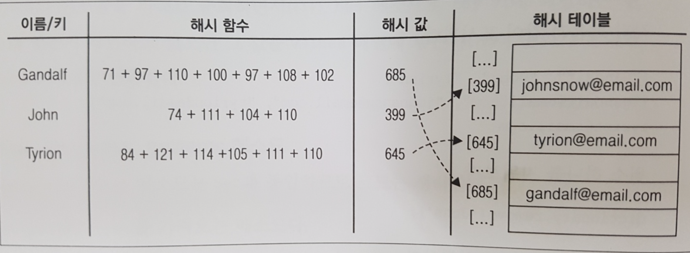

## Hash Table?

- `Hashing` 은 자료 구조에서 특정 값을 가장 신속하게 찾는 방법이다. 
- 링크드 리스트에의 경우 특정 원소를 찾기 위해 자료구조가 가진 모든 원소를 루프를 통해 탐색해야 한다. 
- 배열의 경우에는 원소 추가 시에 각 원소를 하나씩 뒤로 밀어야 해서 비용이 크다. 
- Hash 함수 는 어떤 `key` 에 해당하는 값의 주소를 테이블에서 찾아주는 함수이므로 조회속도가 빠르고 추가도 간단하다.

## Lose Lose Hash Function

- 가장 흔한 형태의 해시함수 이다. 
- 이때 해시값은 key를 구성하는 문자의 아스키(ASCII) 값을 단순히 더한 것이다. 
- 아래 이메일 주소록이 lose lose Hash 함수의 예이다



## Hash 테이블 구현 

```js
const defaultToString = item => {
  if (item === null) {
    return 'NULL';
  } else if (item === undefined) {
    return 'UNDEFINED';
  } else if (typeof item === 'string' || item instanceof String) {
    return `${item}`;
  }
  return item.toString();
}

class ValuePair {
  constructor(key, value) {
    this.key = key;
    this.value = value;
  }
  toString() {
    return `[#${this.key}: ${this.value}]`;
  }
}

class HashTable {
  constructor(toStrFn = defaultToString) {
    this.toStrFn = toStrFn;
    this.table = {};
  }
  loseloseHashCode(key) {
    if (typeof key === 'number') {
      return key;
    }
    const tableKey = this.toStrFn(key);
    let hash = 0;
    for (let i = 0; i < tableKey.length; i++) {
      hash += tableKey.charCodeAt(i);
    }
    return hash % 37;
  }
  /* djb2HashCode(key) {
    const tableKey = this.toStrFn(key);
    let hash = 5381;
    for (let i = 0; i < tableKey.length; i++) {
      hash = (hash * 33) + tableKey.charCodeAt(i);
    }
    return hash % 1013;
  } */
  hashCode(key) {
    return this.loseloseHashCode(key);
  }
  put(key, value) {
    if (key != null && value != null) {
      const position = this.hashCode(key);
      this.table[position] = new ValuePair(key, value);
      return true;
    }
    return false;
  }
  get(key) {
    const valuePair = this.table[this.hashCode(key)];
    return valuePair == null ? undefined : valuePair.value;
  }
  remove(key) {
    const hash = this.hashCode(key);
    const valuePair = this.table[hash];
    if (valuePair != null) {
      delete this.table[hash];
      return true;
    }
    return false;
  }
  getTable() {
    return this.table;
  }
  isEmpty() {
    return this.size() === 0;
  }
  size() {
    return Object.keys(this.table).length;
  }
  clear() {
    this.table = {};
  }
  toString() {
    if (this.isEmpty()) {
      return '';
    }
    const keys = Object.keys(this.table);
    let objString = `{${keys[0]} => ${this.table[keys[0]].toString()}}`;
    for (let i = 1; i < keys.length; i++) {
      objString = `${objString},{${keys[i]} => ${this.table[keys[i]].toString()}}`;
    }
    return objString;
  }
}
```

### loselose Hash Code

```js
loseloseHashCode(key) {
    if (typeof key === 'number') {
      return key;
    }
    const tableKey = this.toStrFn(key);
    let hash = 0;
    for (let i = 0; i < tableKey.length; i++) {
      hash += tableKey.charCodeAt(i);
    }
    return hash % 37;
  }
```

- key를 구성하는 각 문자의 아스키 값을 합하는 함수
- key 문자열의 길이만큼 루프를 반복하면서 문자별 아스키 값[tableKey.charCodeAt(i)]을 hash 에 더한다.
- 루프가 끝난 후, 아스키 수치가 작은 영역에 있음을 감안해 hash를 임의의 숫자로 나눈 나머지를 최종값으로 반환

### Get, Remove

```js
  get(key) {
    const valuePair = this.table[this.hashCode(key)];
    return valuePair == null ? undefined : valuePair.value;
  }

  remove(key) {
    const hash = this.hashCode(key);
    const valuePair = this.table[hash];
    if (valuePair != null) {
      delete this.table[hash];
      return true;
    }
    return false;
  }
```

- get, remove 함수가 호출될 때 인자로 받은 key를 해쉬값으로 바꾼 뒤 테이블에서 조회함  

## HashTable 클래스 사용

```js
const hash = new HashTable();

hash.put('Ygritte', 'ygritte@email.com');
hash.put('Jonathan', 'jonathan@email.com');
hash.put('Jamie', 'jamie@email.com');

console.log(hash.get('Ygritte')); // ygritte@email.com
console.log(hash.get('Jonathan')); // jonathan@email.com

hash.remove('Ygritte');
```

## HashTable 간 충돌 해결 

- 키는 다른데 해당 키로 얻은 해쉬값이 동일한 경우가 있다. `HashTable` 인스턴스에서 동일한 인덱스에는 다른 값이 들어 있어야 하는데, 이런 상황을 **충돌**이라 부른다. 
- 아래 코드를 실행해서 결과를 보자

```js
hashTable.put('Ygritte', 'ygritte@email.com');
hashTable.put('Jonathan', 'jonathan@email.com');
hashTable.put('Jamie', 'jamie@email.com');
hashTable.put('Jack', 'jack@email.com');
hashTable.put('Jasmine', 'jasmine@email.com');
hashTable.put('Jake', 'jake@email.com');
hashTable.put('Nathan', 'nathan@email.com');
hashTable.put('Athelstan', 'athelstan@email.com');
hashTable.put('Sue', 'sue@email.com');
hashTable.put('Aethelwulf', 'aethelwulf@email.com');
hashTable.put('Sargeras', 'sargeras@email.com');
```

- 결과는 다음과 같다.

```js
//{4 => [#Ygritte: ygritte@email.com]},{5 => [#Jonathan: jonathan@email.com],[#Jamie: jamie@email.com],[#Sue: sue@email.com],[#Aethelwulf: aethelwulf@email.com]},{7 => [#Jack: jack@email.com],[#Athelstan: athelstan@email.com]},{8 => [#Jasmine: jasmine@email.com]},{9 => [#Jake: jake@email.com]},{10 => [#Nathan: nathan@email.com],[#Sargeras: sargeras@email.com]}
```
