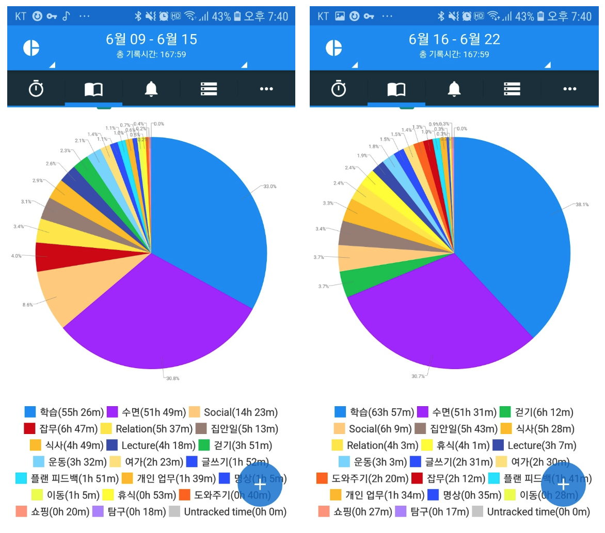

## 883-889일 기록 

## 배운 것

- CSS Animation
- JS iterator, iterable, generator, 반복문의 추상화 개념
- JS 지연 평가
- CSS rem, em, variable 활용
- 네트워크 1계층, 2계층
- 루틴, 서브 루틴, 코루틴 개념
- 블로킹, 논블로킹, Sync, Async

## 잘한 것

- 집에 일찍 도착한 것
- 집에 갈때 휴대폰 락 걸어둔 것

## 못한 것

- 중간 중간 휴식 및 명상 제대로 취하지 못한 것

## 이번주 도전

- [ ] 케스케이딩 관련 정리 및 학습

- [x] 모던 웹을 위한 html, css 6,7 완성

- [x] SASS, BEM 학습

- [x] 네트워크 하루 1장 이장 정리

- [x] ADT Set 자료형 정리

- [x] 코드스피츠 JS 기초강의 모두 듣기

## 다음주 도전

- [ ] 네트워크 5장 이상 정리
- [ ] ADT 해쉬 자료형 정리 
- [ ] 코드스피츠 JS 함수와 OOP 정리 
- [ ] 인프런 중급 강의 정리
- [ ] Promise 정복 및 미션 완료 

## FEEDBACK

### 감사(19.06.16)

지난번 g-pause 에서 감사하는 마음을 갖는 상태가 행복에 큰 영향을 준다는 정보를 얻게 되었다. 최근 들어 나에게 부족한 것만을 생각하며 지냈다. 그러나 잘 돌아보면 감사할 일이 많다. 좀 더 행복한 나를 위해 감사할 것들에 대해 생각해보자. 일단 먹고 사는 문제에 대해 자유롭다. 매일 비싼 음식을 먹을 수는 없지만, 부족함이 없다. 둘째, 하고자 하는 일을 위해 공부할 수 있다. 셋째, 주변에 좋은 사람들이 많다. 넷째, 건강하다. 지금 열거한 것 이외에도 매일 감사한 일들이 많다.

감사의 상태가 행복을 유발하지만 지속되지 못하는 것은 지금의 것들에 감사하고 만족할 때, 인간이 더 이상 다른 무언가를 추구하지 않기 때문으로 추측된다. 쉽게 감사한 것들을 잊는 이유다. 의식적으로 감사한 것들을 생각하도록 하자. 어렵다면 매주 회고에 감사한 것들을 적어보는 것도 좋다.

### 차분히 돌아보기 (19.06.18)

iterator, iterable, generator 구문이 무척어려웠다. 그러나 포기하지 않고 차분히 생각해보니 이해가 됬다. 너무 조급해 하지 않고 꾸준하게 노력하면 풀리기 시작한다. 지금 어려운 걸 하고 있다. 그것을 인지하자. 쉽게 이해되는 것이 더 낯설다.

### 우선순위 (19.06.23)

"우선순위와 무관하게 하고 싶은 것에 집중하고 있다. 우선순위에 집중하자. HTML, CSS 를 하기로 했으면 그것에 집중하자. 좀 더 객관적으로 판단하자. 그리고 중간 중간 휴식을 제대로 취하자." 라고 다짐했으나 이번주 일요일에 블로그 CSS 꾸미기에 완전히 몰두해버렸다. 

계획없이 달려든 댓가는 컸다. 큰 개선없이 많은 시간을 허비했다. 로직이 뒤엉켜 다시 복구하는데 많은 시간을 썼다. 우선순위를 제대로 지키자고 글을 쓴 것이 벌써 열 손가락으로 셀 수 없을 만큼 많다. 이번에는 왜 우선순위를 벗어나서 생활하게 되는지 분석글을 써본다. 

### 늪에 빠지는 순간들

우선순위에 엇나가 다른일에 몰두할 때 일정한 패턴이 있다. **첫째는 해당 시간에 무언가를 해야한다는 구체적 계획이 없다.** 계획이 없고 할 일이 많을 때 무엇을 해야할지 선택하느라 인지자원을 소모한다. 그리고 선택이 어려울 때는 뇌는 간단하고 빠르게 그냥 하고싶고 흥미가 당기는 일을 선택하게 된다. 

**둘째, 시작하는 일에 구체적 달성 목표가 없다**. 보통 무엇을 하기 위한 목적으로 시작으로 일을 시작해야 끝이 난다. 예를들면 블로그의 사이드바 정렬을 개선하는 것이 이번 일의 목표라고 정의하면 거기까지만 하게된다. 그러나 오늘은 블로그 개선이라는 모호한 목표를 가지고 일을 시작했다. 블로그 개선이라는 추상적 목표에는 많은 일이 들어간다. 좀 더 구체적으로 목표를 설정하고 일을 시작해야 한다. 

**셋째, 하다가 다른 할 일을 또 생성한다.** 빠져서 하다가 뭔가를 잘 못 건드리거나 구미가 당기는  일을 찾게 되고 하고 있는 일을 마루리 짓지 않은 상태에서 다른 일을 시작한다. 마무리 짓지 않은 상태에서 다른 일을 시작했기 때문에 여전히 구체적이지 않은 목표로 일을 시작한다.  또한 마무리 짓지 않은 일이 다른 일을 전개할 때 문제가 엉키고 꼬여서 또 다른 문제를 양산한다. Nagative Circle의 시작이다. 

**넷째, 안풀리는 일을 풀기 위해 과몰입 한다.** 과몰입 상태에서 인지되는 내용이 적어지고 실수할 확률이 늘어난다. 더욱더 깊은 늪으로 빠지기 좋은 상태가 된다. 이런 문제들을 해결하기 위한 방법을 생각해보자. 

### 늪에서 벗어나기 위한 방법

**첫째, 할일이 많은데 무엇을 먼저 해야할지 고민일 때**는 우선 3분간 짧은 명상을 한다. 그리고 지금 나를 둘러싼 많은 일들이 실제로는 그렇게 중요하거나 다급한 일이 아님을 깨닫는다. 그리고 지금 느끼는 조급함을 인지하고, 이 조급해 하는 마음이 실제 일을 수행하는 것에 도움이 되지 않는다는 사실을 깨닫는다.

**둘째, 차분하게 해야할 일의 중요도와 순서를 정리 해본다.** 정리 자체가 일이 된 다면 해야하는 일들 중 가장 작고 구체적인 일을 우선적으로 시행한다. 작은 일을 완성하면 성취도와 자기 효능감을 얻는다. 그 다음 계속해서 작고 구체적인 일들을 해나간다. 성공을 익숙하게 해서 자신을 안정시킨다. 

**셋째, 위에서 열거한 방법들이 사실 통하지 않는 때가 더 많다. 그때는 밖에 나가서 걸으며 음악을 듣거나 운동을 한다.** 그 과정중에 마음이 안정을 되찾고  더 나은 선택을 할 수 있는 기회를 얻게된다. 여유가 된다면 명상을 곁들여도 좋다. 여유가 생겼을 때 TODO List로 해야할 일의 목록을 정한다. **목표는 구체적이고 작아야하다.**  

**넷째, 마구 하고싶은 일이 있다면 TODO List 관리함에 하고 싶은 일을 넣어둔다**. 나중에 시간과 여유가 생겼을 때 그 일을 하면된다. 그리고 그렇게 관리함에 넣어둔 일을 나중에 보면 실상 그렇게 중요하거나 마구 하고싶은 느낌이 들지 않는다. 앞에서 열거한 방법으로 늪에 빠지는 것을 방어할 수 있다. 정리했으니 꼭 실천하도록 노력하자. 