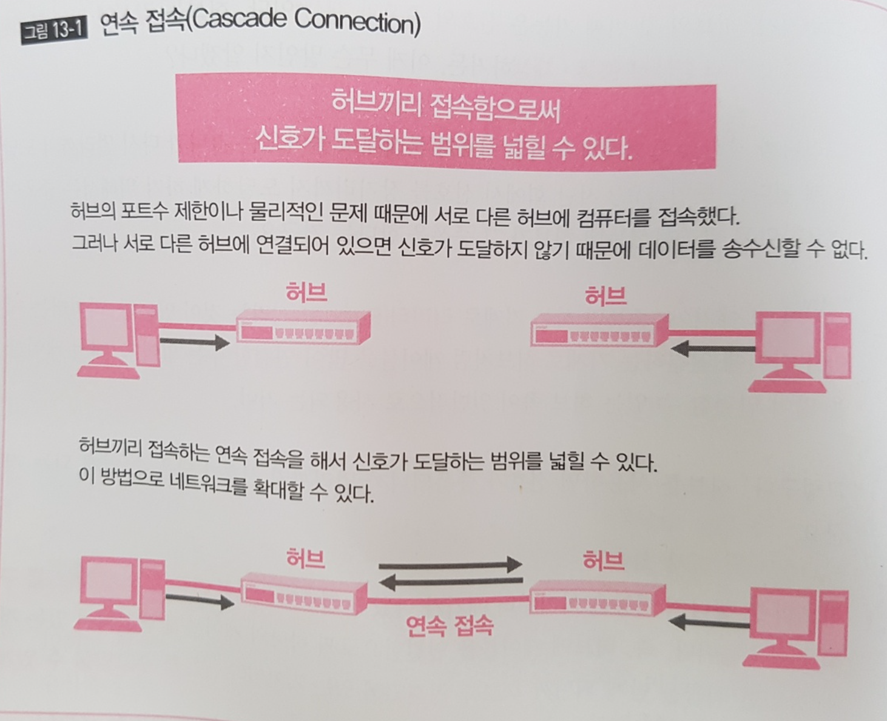
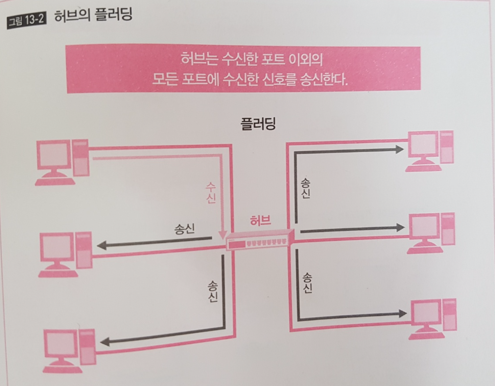

---

title: TIL 190619 | Sass, OSI 7 layer 1계층
date: '2019-06-19T10:46:37.121Z'
template: 'post'
draft: false
slug: 'til/190619'
category: 'TIL'
tags:
  - 'TIL'
  - 'Log'
description: 'Sass, OSI 7layer에 대해 공부했다.' 

---

## Sass

- & 상속 
- mixin 활용
- variable 활용

> ### 참고
>
> - [veloport](https://velopert.com/1712)
> - [poiemaweb](https://poiemaweb.com/sass-basics)

## OSI 7 레이어, 1계층의 역할과 개요 

- 1계층의 역할은 케이블이 연결되어 있는 기기에 신호를 전달하는 것
- 1계층의 역할에 의해 상대에게 데이터가 전달
- 통신 매체에는 유선과 무선이 있고 유선에는 동선 UTP와 광파이버가 있음

### 인터페이스 

- 컴퓨터와 케이블의 중개역으로 신호를 케이블로 보내고 전달된 신호를 받는 역할
- 컴퓨터의 데이터를 케이블 신호로 변환, 케이블에서 보내온 신호를 컴퓨터에서 사용하는 데이터로 변환
- Lan 용 인터페이스는 NIC(Network Interface card), Wan의 경우 DCE(Data Circuit terminating Equipment)라는 별도의 신호 변환기 사용 

## 신호와 충돌

- 비트를 신호로 바꾸어 케이블에 보냄으로써 상대에게 전함
- 신호의 형태나 전송 방법에 의해 통신속도가 정해짐
- 신호는 감쇠, 노이즈, 간섭 충돌 등의 문제가 발생 

### 신호와 통신속도 

- 1초 동안 전해지는 비트수 bps(bit per second)
- ex) 40Mega -> 40,000,000bps 

## 허브 

- 허브는 신호의 증폭과 재생을 수행
- 다수의 컴퓨터를 연결(T자 분배기 대신)
- 허브는 수신한 신호에 대해 어떤 제어도 하지 않음 &rarr; 허브에 연결된 기기가 동신에 신호를 보내면 플러딩으로 인한 충돌 가능성이 생김 
- 신호를 송신하면 충돌이 발생할지도 모르는 범위를 충돌 도메인(Collision Domain) 이라 부름 
- 허브로 연결되어 있는 컴퓨터는 충돌 도메인에 있게됨
- 충돌 도메인은 작아야함 &rarr; 스위치가 이 역할을 담당하게 됨 

### 연속 접속(Cascade Connection)

### 허브의 플러딩

> ### 참고 
>
> - 하루 3분 네트워크 교실

